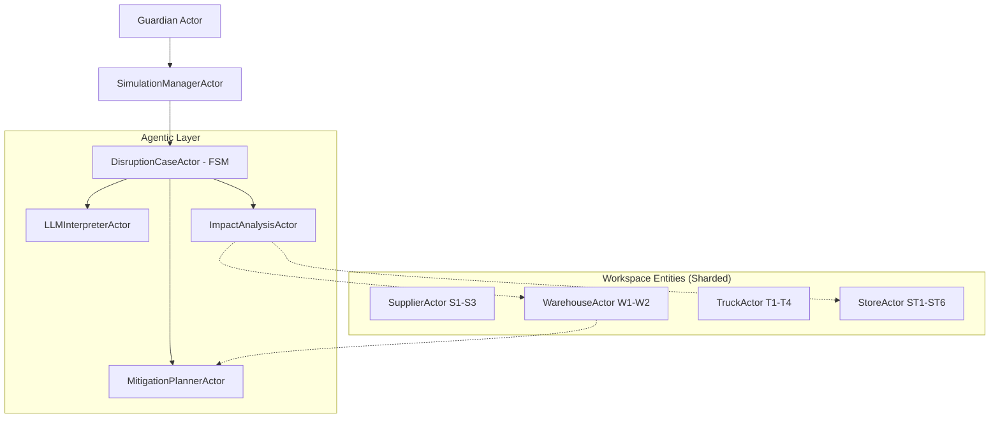

# 🛡️ Project Documentation: Agentic Supply Chain Disruption Management
## CSYE 7374 - Intro to AI Agent Infrastructure

### 📌 1. Project Summary
This system is a **distributed, event-driven orchestration engine** designed to manage large-scale supply chain disruptions. It leverages a **Multi-Agent Actor System** (Akka Typed) and **Large Language Models** (Amazon Bedrock / Claude 3.5 & 4.6) to transform raw, unstructured disruption reports (e.g., "A hurricane flooded W1") into structured mitigation protocols that can be executed autonomously or with human oversight.

The system is built on **Event Sourcing** and **Cluster Sharding** principles, ensuring that every entity (Supplier, Warehouse, Truck, Store) is a persistent actor with its own state, history, and autonomous logic.

---

### 🛠️ 2. Tools and Technologies
| Category | Technology | Purpose |
| :--- | :--- | :--- |
| **Backend Core** | **Akka Typed (Scala)** | Fault-tolerant, distributed actor model for entity management. |
| **Logic Layer** | **Akka FSM / Persistence** | Managing complex disruption lifecycles with event-sourced journals. |
| **Intelligence** | **Amazon Bedrock (Claude 3.5/4.6)** | Natural language extraction (NLP) and recovery planning (Reasoning). |
| **Persistence** | **PostgreSQL (Akka Persistence JDBC)** | Durable event journal and snapshot store for actor recovery. |
| **Frontend** | **React + Vite + Tailwind** | Real-time topological impact visualizer and command center. |
| **Infrastructure** | **Docker Compose** | Orchestrating the Postgres database and system dependencies. |
| **API Layer** | **Akka HTTP + Spray JSON** | Reactive REST ingress for disruption reports and monitoring. |

---

### 🚀 3. Implemented Features (How, Where, Why)

#### A. Agentic Disruption Extraction
*   **How**: Uses a specialized `LLMInterpreterActor` that pipes natural language via the Bedrock Converse API to extract domain-specific JSON.
*   **Where**: `com.supplychain.actors.workflow.LLMInterpreterActor` and `com.supplychain.llm.BedrockLlmClient`.
*   **Why**: Human supply chain reports are messy (emails, Slack, news). We need a "thinking" layer to map "flooding in Gulf" to `WAREHOUSE_SHORTFALL` on `W1`.

#### B. Topological Impact Analysis
*   **How**: When a disruption is extracted, the `ImpactAnalysisActor` traverses the supply chain graph. It queries dependent entities (e.g., "W1 is flooded, which Trucks reach it? Which Stores depend on it?").
*   **Where**: `com.supplychain.actors.workflow.ImpactAnalysisActor` using Akka's `AskPattern`.
*   **Why**: To provide a holistic view of the disruption's "blast radius" beyond the primary point of failure.

#### C. Adaptive Recovery Planning
*   **How**: A `MitigationPlannerActor` takes the topological impact data and feeds it back to the LLM (Claude) to generate a prioritized list of actions.
*   **Where**: `com.supplychain.actors.workflow.MitigationPlannerActor`.
*   **Why**: Every disruption is unique. A static rule-engine cannot handle complex trade-offs like "Reroute Supplier A" vs "Hold shipments to Store B".

#### D. Event-Sourced Entity Mesh
*   **How**: Every entity (e.g., Warehouse `W1`) is a `PersistentEntity` actor. It journaled every change (StockUpdate, DisruptionDetected).
*   **Where**: `com.supplychain.actors.domain.WarehouseActor`, `SupplierActor`, etc.
*   **Why**: For auditability and resilience. If a node crashes, it replays its event stream from PostgreSQL to recover its exact state.

---

### 🎭 4. Akka Actor Hierarchy (The Mesh)

*   **How**: We use **Cluster Sharding** (via `GuardianActor`) to ensure only one instance of `Warehouse("W1")` exists in the entire cluster.
*   **Where**: Registration happens in `com.supplychain.actors.GuardianActor`.
*   **Why**: This prevents "split-brain" scenarios where two actors try to manage the same physical warehouse stock.

---

### 🧠 5. Implementation Deep Dive (How, Where, Why)

#### Q: How is the LLM kept grounded in real data?
*   **Where**: `PromptBuilder.scala` and `MitigationPlannerActor.scala`.
*   **Why**: LLMs hallucinate. 
*   **How**: We don't just ask the LLM "what should I do?". We first run a topological query to find *real* affected IDs (`W1`, `T2`) and pass *them* into the prompt as "Ground Truth". The LLM is forced to pick from available Recovery Tools.

#### Q: How is non-blocking I/O handled with the LLM?
*   **Where**: `LLMInterpreterActor.scala`.
*   **Why**: Actor threads are precious. If we block on a 5-second LLM call, the whole system hangs.
*   **How**: We use the `pipeToSelf` pattern. The LLM call returns a `Future[T]`. When it completes, Akka automatically sends the result as a message to the actor's mailbox, maintaining thread safety.

#### Q: Why CborSerializable?
*   **Where**: `Events.scala` and `Commands.scala`.
*   **Why**: Akka's default Java serialization is slow and insecure.
*   **How**: Every message that goes to the database (Journal) or across the network (Sharding) implements `CborSerializable`, mapping to Jackson-CBOR for high-performance binary encoding.

---

### 🖼️ 6. System Visuals & Dashboards

#### The Command Center (Main Interface)

> [!NOTE]
> The dashboard visualizes the live topological layer. Nodes change color (Red/Yellow) based on live disruption events processed through the Akka mesh.

#### Real-Time Impact Analysis

> [!TIP]
> This view shows the "Blast Radius" of a warehouse flooding. Notice how ST1 and ST2 are automatically flagged because they depend on W1.

#### LLM-Generated Recovery Protocol

> [!IMPORTANT]
> These actions (REROUTE, RESTOCK) are generated by Claude 4.6 in response to the specific network conditions extracted in Phase 1.

---

### 🛡️ 7. Other Key Features
1.  **Fault Isolation**: If the Bedrock API is down, the `LLMInterpreterActor` uses a **Restart with Backoff** strategy. The rest of the Supply Chain (stock updates, truck tracking) continues to function.
2.  **Audit Trail**: Every disruption case has a full audit record in the database, including the raw text, the extracted event, and the final mitigation plan.
3.  **Scalable Topology**: The system supports increasing the number of warehouses/stores by simply updating the `application.conf`. The sharding logic automatically balances the load.

---

### 👨‍🏫 8. Final Message for Reviewers
> "This project demonstrates the transition from traditional 'if-else' logic to an **Aggregated Reasoning Architecture**. By combining the rigid reliability of Akka Actors with the fluid intelligence of Claude, we’ve created a system that doesn't just notify you of a problem—it reasons about it and proposes a solution."

---
*Documentation generated by Antigravity AI on behalf of the project team.*
