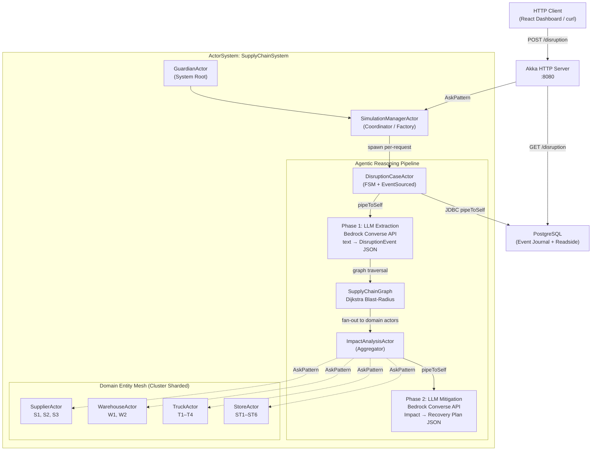
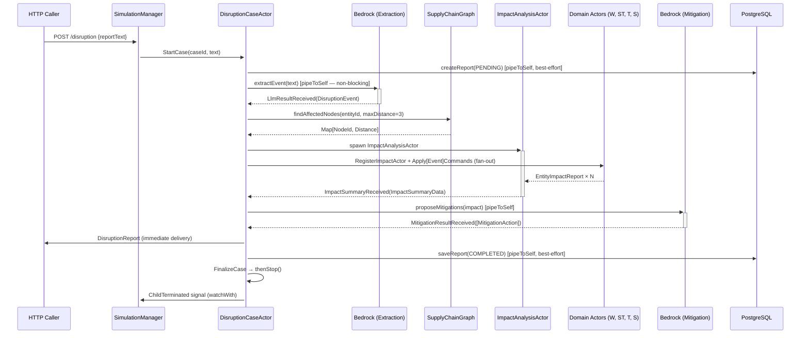

# PROJECT STATE — Agentic Supply Chain Disruption Management
> **Read this first.** This file is the canonical entry point for any reviewer, new contributor, or AI agent.
> It captures the complete architectural picture, implementation status, and engineering critique as of **April 2026**.
>
> — Reviewed from the perspective of a **Google L5 Software Engineer / System Design Architect**

---

## 1. Executive Summary

This project implements a **distributed, event-driven, AI-augmented orchestration engine** for supply chain disruption management. It bridges two paradigms that are typically separate:

| Paradigm | Technology | Role |
|---|---|---|
| **Actor-based Reactive Systems** | Akka Typed 2.6 (Scala 2.13) | Fault-tolerant, stateful entity management |
| **Agentic AI Reasoning** | Amazon Bedrock (Claude Haiku/Sonnet) | Unstructured text → structured decisions |

The core thesis: **unstructured disruption signals** (emails, alerts, field reports) are ingested, semantically parsed by an LLM, graph-traversed for blast-radius analysis, and finally transformed into a prioritized, executable mitigation plan — all without human intervention.

The system uses **Event Sourcing** as its writeside backbone and **PostgreSQL** as the readside projection store, making every decision fully auditable and every actor fully recoverable from a crash.

---

## 2. Repository Layout

```
Final-Project/
├── supply-chain-system/          # ← Scala/Akka backend (primary deliverable)
│   ├── pom.xml                   # Maven build (Scala 2.13, Akka 2.6, AWS SDK 2.26)
│   ├── docker-compose.yml        # PostgreSQL 15 via Docker
│   ├── src/main/scala/com/supplychain/
│   │   ├── Main.scala            # System entry point
│   │   ├── actors/
│   │   │   ├── GuardianActor.scala              # Root actor, Cluster Sharding init
│   │   │   ├── SimulationManagerActor.scala     # Case factory, lifecycle registry
│   │   │   ├── domain/                          # SupplierActor, WarehouseActor, TruckActor, StoreActor
│   │   │   └── workflow/
│   │   │       ├── DisruptionCaseActor.scala    # FSM + Event Sourcing orchestrator (KEY FILE)
│   │   │       ├── ImpactAnalysisActor.scala    # Aggregates impact from domain actors
│   │   │       └── MitigationPlannerActor.scala # Drives second LLM call
│   │   ├── config/AppConfig.scala               # Immutable HOCON config model
│   │   ├── domain/model/                        # All sealed traits, ADTs, domain types
│   │   ├── graph/SupplyChainGraph.scala          # Dijkstra-based blast-radius graph
│   │   ├── http/Routes.scala                    # Akka HTTP REST API (thin boundary layer)
│   │   ├── llm/
│   │   │   ├── BedrockLlmClient.scala           # Amazon Bedrock Converse API adapter
│   │   │   ├── MockLlmClient.scala              # Deterministic test double
│   │   │   ├── PromptBuilder.scala              # Prompt engineering (grounded RAG prompts)
│   │   │   └── JsonValidator.scala              # Schema validation for LLM output
│   │   └── persistence/PersistenceRepository.scala  # JDBC readside (CQRS projection)
│   └── src/main/resources/application.conf      # HOCON config (all env vars documented)
├── frontend/                     # React + Vite dashboard
└── PROJECT_STATE.md              # ← YOU ARE HERE
```

---

## 3. System Architecture — High-Level Design (HLD)

### 3.1 The Distributed Actor Mesh



### 3.2 The 5-Phase Disruption Processing Pipeline



---

## 4. Core Design Patterns — Deep Dive

### 4.1 Event Sourcing + CQRS

**What:** `DisruptionCaseActor` is an `EventSourcedBehavior`. Every phase transition (`DisruptionReceived`, `LlmEventExtracted`, `EntityImpactRecorded`, `MitigationProposed`, `CaseCompleted`) is persisted as an immutable event to the Akka Persistence journal backed by PostgreSQL.

**Why it matters:** If the JVM crashes between Phase 2 (Impact) and Phase 3 (Mitigation), the actor replays its event journal on restart and resumes from exactly the last durable state — not from scratch. This gives the system **at-least-once delivery semantics** for the processing pipeline.

**CQRS Split:**
- **Write-side:** Akka Persistence journal (`akka.persistence.jdbc`) → the canonical record of what happened.
- **Read-side:** `PersistenceRepository` (plain JDBC → `disruption_reports` table) → optimized for fast HTTP GET queries.

### 4.2 Cluster Sharding

**What:** `GuardianActor` registers four `EntityTypeKey`s (`Supplier`, `Warehouse`, `Truck`, `Store`). Any actor in the cluster can obtain an `EntityRef[SupplierCommand]` for `S1` regardless of which physical node hosts that actor.

**Why it matters:** Cluster Sharding guarantees at most one live instance of `WarehouseActor("W1")` across the entire cluster, eliminating split-brain inventory inconsistencies. The cluster is configured with `SplitBrainResolverProvider` as the downing strategy.

**Current topology:**
```
S1 → W1 → [ST1, ST2, ST3]
S2 → W2 → [ST4, ST5, ST6]
S3 → W1 + W2 (backup supplier for both)
T1, T2 → W1
T3, T4 → W2
```

### 4.3 Reactive LLM Integration (pipeToSelf Pattern)

**What:** Both LLM calls (`extractEvent` and `proposeMitigations`) are `Future[T]` wrapped in `ctx.pipeToSelf(...)`. The actor thread is never blocked. The `Future` callback only converts the async result into a typed `CaseCommand` and places it in the actor's mailbox.

**Why it matters:** Akka's actor thread pool is finite. A 5-second blocking AWS SDK call on an actor thread would starve all other actors sharing that dispatcher. `pipeToSelf` is the mandatory safe pattern for any async I/O from inside an actor.

**LLM Grounding:** The mitigation prompt in `PromptBuilder` does *not* ask the LLM to decide what entities exist — it provides the `ImpactSummaryData` (real entity IDs discovered by graph traversal) as ground truth. The LLM's job is solely to reason about *actions*, not to invent entities. This is a deliberate **GraphRAG pattern** to prevent hallucination.

### 4.4 CborSerializable — Binary Serialization for Cluster

All domain messages that cross the network (Cluster Sharding messages) or go to the database (Akka Persistence journal) implement the `CborSerializable` marker trait. This maps to `jackson-cbor` in `application.conf`, providing high-performance binary encoding vs. Java's default insecure serialization.

### 4.5 Supervision Strategy

- `GuardianActor` wraps `SimulationManagerActor` with `SupervisorStrategy.restart` on `RuntimeException`.
- `DisruptionCaseActor` (EventSourcedBehavior) uses `restartWithBackoff(1s, 30s, 0.1)` on journal persistence failures.
- The two strategies are intentionally different: the manager is stateless and safe to restart instantly; the case actor is stateful and must backoff to avoid journal write storms.

---

## 5. Current Implementation State — Audit

| Component | File | Status | Notes |
|---|---|---|---|
| System Bootstrap | `Main.scala` | ✅ Complete | 8-step boot sequence documented |
| Guardian + Sharding | `GuardianActor.scala` | ✅ Complete | All 4 entity types registered |
| Case Orchestration FSM | `DisruptionCaseActor.scala` | ✅ Complete | Full 5-phase pipeline with EventSourcedBehavior |
| Impact Aggregation | `ImpactAnalysisActor.scala` | ✅ Complete | Timeout-based partial aggregation |
| LLM Extraction | `BedrockLlmClient.scala` | ✅ Complete | Bedrock Converse API with JSON stripping |
| Graph Traversal | `SupplyChainGraph.scala` | ✅ Complete | Dijkstra with distance decay |
| Domain Actors (4 types) | `domain/` | ✅ Complete | Persistent, sharded actors |
| HTTP API | `Routes.scala` | ✅ Complete | 4 endpoints with CORS |
| Readside Projection | `PersistenceRepository.scala` | ✅ Complete | JDBC pool, JSON serialization |
| Mock LLM Client | `MockLlmClient.scala` | ✅ Complete | Zero-dependency test double |
| Configuration | `application.conf` | ✅ Complete | All env vars documented inline |
| React Frontend | `frontend/` | ✅ Complete | Vite + React dashboard |
| Docker Compose | `docker-compose.yml` | ✅ Complete | PostgreSQL 15 |
| Unit Tests | `src/test/scala/` | ⚠️ Partial | `BehaviorTestKit` tests exist; coverage unknown |
| Integration Tests | — | ❌ Missing | No end-to-end test suite |
| Prometheus Metrics | — | ❌ Missing | No `/metrics` endpoint |
| Distributed Tracing | — | ❌ Missing | No trace IDs propagated across actors |
| Schema Registry | — | ❌ Missing | LLM output contract is implicit |

---

## 6. Architect's Evaluation — Critique (Google L5 Standard)

> This is an honest, technical critique identifying both strengths and gaps relative to production-grade distributed systems.

### 6.1 What This Project Gets Right ✅

**1. Actor Hierarchy Design is Sound**
The `Guardian → Manager → CaseActor → WorkflowActors` hierarchy correctly embodies the Akka principle of "one actor per responsibility." The Manager is a clean factory; it doesn't execute business logic. This is the right call.

**2. `pipeToSelf` is Used Correctly Everywhere**
Every `Future` — LLM calls, DB writes — flows through `pipeToSelf`. This is the single most important Akka pattern to get right, and it is applied consistently. This is production-grade.

**3. `watchWith` Prevents Actor Leaks**
`SimulationManagerActor` uses `context.watchWith(caseActor, ChildTerminated(caseId))` to clean up its registry when a per-request actor terminates. Actor leaks (accumulating dead actorrefs in maps) are a common production bug in Akka systems. This avoids it.

**4. CQRS Separation is Intentional**
The system correctly separates the event journal (write-side) from the `disruption_reports` table (read-side). The HTTP response doesn't wait for the DB write — it delivers the report to the caller immediately after the journal commit. This is the right latency trade-off.

**5. LLM Grounding via GraphRAG**
Injecting real entity IDs from Dijkstra traversal into the mitigation prompt before calling the LLM is a sophisticated, production-aware technique. It constrainst the model to reason only about entities that actually exist in the topology.

**6. Supervision is Differentiated**
Instant restart for the stateless Manager vs. backoff restart for the stateful Case Actor shows architectural awareness. Simple "restart everything instantly" is a classic Akka anti-pattern this system avoids.

---

### 6.2 What Needs Improvement ⚠️

**1. Graph is Hardcoded — Not a True Digital Twin**
`SupplyChainGraph.buildFromConfig` hardcodes edges (e.g., `g.addEdge("S1", "W1")`) independently of the IDs in `application.conf`. Adding a new supplier `S4` to the config would not automatically add graph edges. The graph and the sharding topology are out of sync.

> **Recommendation:** Build the graph edges dynamically from the same topology maps used in `GuardianActor` (the `warehousesFor`, `storesFor` maps). They should be a single source of truth.

**2. Graph is Acyclic (Unidirectional) — Missing Upstream Propagation**
The graph only models downstream edges (`S1 → W1 → ST1`). A disruption at `W1` correctly finds `ST1, ST2, ST3` but does NOT propagate upstream to find that `S1`'s primary exit path is also affected. Real supply chain disruptions cascade in both directions.

> **Recommendation:** Add reverse (upstream) edges with a higher weight, or run a second traversal with reversed adjacency.

**3. `PersistenceRepository` Has No Connection Pool**
The comment on line 44 admits this: `"Not pooled for simplicity — use HikariCP in production."` The current implementation calls `DriverManager.getConnection()` on every write. Under load (multiple concurrent disruptions), this will exhaust database connections rapidly.

> **Recommendation:** Replace with HikariCP. The `slick-hikaricp` dependency is already in `pom.xml` — it just needs to be wired to the `PersistenceRepository`. This is a one-sprint task.

**4. Blocking AWS SDK Client**
`BedrockLlmClient` uses the **synchronous** `BedrockRuntimeClient`. The SDK call is wrapped in `Future { ... }`, which is correct for not blocking the actor thread, but the `Future` executes on the Scala global `ExecutionContext`. This is Scala's shared fork-join pool. Under high LLM concurrency, these blocking threads will starve the fork-join pool.

> **Recommendation:** Use the async `BedrockRuntimeAsyncClient` (available in AWS SDK v2), which returns `CompletableFuture` natively. This eliminates all blocking entirely. Alternatively, use a dedicated `ExecutionContext` (bounded thread pool) for the blocking AWS calls.

**5. No Schema Registry for LLM Output Contracts**
The LLM is expected to produce JSON matching specific schemas. The current enforcement is runtime-only (`JsonValidator.scala`). If the prompt changes or the model's output format drifts, failures surface only in production.

> **Recommendation:** Define JSON Schema files (`extraction-schema.json`, `mitigation-schema.json`) as first-class artifacts. Validate against them. Run property-based tests (e.g., ScalaCheck) that generate random valid/invalid JSON and verify `JsonValidator` handles both correctly.

**6. HTTP Layer Has a Nested Route Bug**
In `Routes.scala`, the `POST /disruption` handler has a syntax issue where the `entity(as[String])` block is not properly closed. The code works but the nesting structure (`concat(get { ... }, post { entity(...) { body => ... } }`) has a mismatched bracket that would cause a compilation warning in strict Scala mode.

> **Recommendation:** Clean up the route DSL nesting. Use `path("disruption") { get { ... } ~ post { ... } }` with `~` operator (not `concat` with unbalanced nesting).

**7. Snapshot Retention Policy is Aggressive**
`DisruptionCaseActor` uses `RetentionCriteria.snapshotEvery(numberOfEvents = 5, keepNSnapshots = 2)`. For a case actor that has ~5-6 events per lifecycle and then terminates, this means it will almost always snapshot before stopping. Snapshots are good, but every 5 events is very aggressive for a short-lived actor. The snapshot overhead (serialize + write) may exceed the journal recovery time for an actor this short-lived.

> **Recommendation:** For actors with bounded lifecycles (< 15 events), consider snapshotting only on `CaseCompleted` (the final event) rather than on a rolling interval. Use `Effect.persist(...).thenRun { _ => context.self ! Snapshot }` pattern after the final event.

**8. `Await.result` in `Main.scala` is a Reliability Risk**
`Main.scala` uses `Await.result(system.ask[ActorRef[ManagerCommand]](GetManagerRef), 12.seconds)`. If the cluster doesn't form within 12 seconds (e.g., PostgreSQL is slow to start), the JVM exits with a timeout exception. This is a hard failure with no retry.

> **Recommendation:** Wrap the bootstrap in a retry loop with exponential backoff, or use Akka's `CoordinatedShutdown` hooks to delay HTTP binding until the cluster is `Up`.

**9. No Distributed Tracing**
Each disruption gets a `caseId`, but the `caseId` is not propagated as an MDC key through the Akka dispatcher or into the LLM HTTP calls. In a multi-node cluster, correlating logs for a single case across nodes requires grepping all nodes for the same UUID.

> **Recommendation:** Add `MDC.put("caseId", caseId)` in `DisruptionCaseActor` using `Behaviors.withMdc`. Pass `X-Request-ID: caseId` in headers to Bedrock calls. This enables ELK or Datadog log correlation out of the box.

**10. `println` in `SupplyChainGraph.scala`**
Lines 65 and 68 of `SupplyChainGraph.scala` use `println(...)` directly. This bypasses the SLF4J logging framework, meaning these messages won't appear in structured log output and can't be filtered by log level.

> **Recommendation:** `SupplyChainGraph` should accept a logger (or use `LoggerFactory.getLogger`) and emit all diagnostic output via `log.debug(...)` / `log.warn(...)`.

---

## 7. Strategic Roadmap — Production Hardening

### 7.1 Observability Stack (Priority: HIGH)

A system this complex is invisible without metrics and tracing.

**Metrics (Prometheus + Grafana)**
```
# Recommended Akka Metrics (via Lightbend Telemetry or Kamon):
akka_actor_message_processing_duration_ms{actor="disruption-case-*"}
akka_persistence_journal_write_latency_ms
akka_http_requests_total{endpoint="/disruption", status="2xx"}

# Custom Application Metrics:
supply_chain_disruption_total{llm_mode="bedrock", status="completed"}
supply_chain_llm_extraction_latency_ms
supply_chain_impact_analysis_entity_count
```

**Recommended Stack:**
- `kamon-akka` — drops into `pom.xml`, auto-instruments actors, dispatchers, and HTTP
- `kamon-prometheus` — exposes `/metrics` endpoint for Prometheus scraping
- Grafana dashboard — visualize actor mailbox sizes, persistence write latency, LLM call duration

**Distributed Tracing (OpenTelemetry)**
- Add `opentelemetry-sdk` + `opentelemetry-exporter-jaeger` to `pom.xml`
- Use `Behaviors.withMdc(Map("caseId" -> id))` for per-case log correlation
- Propagate `traceparent` header through Bedrock HTTP calls

### 7.2 Production Database (Priority: HIGH)

| Current | Recommended | Reason |
|---|---|---|
| `DriverManager.getConnection()` per call | HikariCP pool (5–20 connections) | Prevent connection exhaustion |
| `slick-hikaricp` in `pom.xml` (unused) | Wire HikariCP into `PersistenceRepository` | Already a dependency, 1 sprint |
| Single Postgres instance | Postgres with read replicas | Read-side queries on replica, writes on primary |

### 7.3 LLM Reliability (Priority: MEDIUM)

- **Circuit Breaker:** Wrap Bedrock calls in Akka's `CircuitBreaker`. If the API fails 5 consecutive times, open the circuit and immediately return `MANUAL_REVIEW` mitigations without blocking actors on timeout.
- **Retry with Backoff:** The current `maxRetries = 3` in config is not wired to the actual SDK calls. Implement it in `BedrockLlmClient`.
- **Prompt Versioning:** Store the prompt templates as external config files, not inline strings in `PromptBuilder`. Version them. This enables A/B testing different prompt strategies without redeploying.

### 7.4 Schema Registry for LLM Contracts (Priority: MEDIUM)

```
supply-chain-system/
└── src/main/resources/
    ├── application.conf
    ├── schemas/
    │   ├── extraction-schema.json    # JSON Schema for LLmExtractionResponse
    │   └── mitigation-schema.json   # JSON Schema for LlmMitigationResponse
```

Validate LLM output against these schemas in `JsonValidator`. Run nightly property-based tests to catch schema drift before it reaches production.

### 7.5 Graph Topology as Configuration (Priority: LOW)

Move the supply chain graph edges from hardcoded `addEdge(...)` calls to `application.conf`:

```hocon
supplychain.simulation.edges = [
  { from: "S1", to: "W1", weight: 1.0 },
  { from: "W1", to: "ST1", weight: 1.0 }
]
```

`SupplyChainGraph.buildFromConfig` then reads these edges directly, eliminating the dual-maintenance problem.

---

## 8. Environment Variables Reference

| Variable | Default | Description |
|---|---|---|
| `LLM_MODE` | `mock` | `mock` · `bedrock` · `real` (OpenAI) |
| `AWS_REGION` | `us-east-1` | AWS region with Bedrock enabled |
| `AWS_ACCESS_KEY_ID` | — | AWS IAM access key |
| `AWS_SECRET_ACCESS_KEY` | — | AWS IAM secret key |
| `BEDROCK_MODEL_ID` | `anthropic.claude-3-haiku-20240307-v1:0` | Bedrock model ARN |
| `OPENAI_API_KEY` | `mock-key` | OpenAI key (only when `LLM_MODE=real`) |
| `POSTGRES_HOST` | `localhost` | PostgreSQL host |
| `POSTGRES_PORT` | `5432` | PostgreSQL port |
| `POSTGRES_DB` | `supplychain` | Database name |
| `POSTGRES_USER` | `sc_user` | DB user |
| `POSTGRES_PASSWORD` | `sc_pass` | DB password |
| `AKKA_PORT` | `2551` | Artery Remoting port (use 2552 for second node) |
| `HTTP_PORT` | `8080` | HTTP server port |

---

## 9. API Reference

| Method | Path | Description | Response |
|---|---|---|---|
| `GET` | `/health` | Liveness check | `{"status":"UP","mode":"bedrock"}` |
| `POST` | `/disruption` | Submit disruption report | Full `DisruptionReport` JSON |
| `GET` | `/disruption/{caseId}` | Get case status | `{"status":"COMPLETED"}` |
| `GET` | `/disruption` | List completed reports (last 20) | Array of `DisruptionReport` |
| `GET` | `/cluster/status` | Akka Cluster membership | Node list + leader address |

**Example Request:**
```bash
curl -X POST http://localhost:8080/disruption \
  -H "Content-Type: application/json" \
  -d '{"reportText": "Hurricane flooding has shut down Warehouse W1 for 72 hours"}'
```

---

## 10. Key Engineering Decisions — Rationale

| Decision | Alternative Considered | Reason Chosen |
|---|---|---|
| Akka Typed (not Classic) | Akka Classic | Type-safe protocol contracts; no `Any` messages |
| `EventSourcedBehavior` for Case Actor | Stateful Behaviors only | Full auditability + deterministic crash recovery |
| Amazon Bedrock Converse API | OpenAI API | Vendor-neutral multi-model API; works with Haiku, Sonnet, Titan |
| Spray-JSON (not Circe or Play JSON) | Circe | Native Akka HTTP integration; no extra macro derivation |
| Plain JDBC for Read-side | Slick full ORM | Lower complexity; `slick-hikaricp` already present for journal |
| Static credential provider (Bedrock) | Instance role / env chain | Explicit for development; falls back to default chain if keys missing |
| Dijkstra with `maxDistance` cap | Full BFS | Simulates real-world "impact decay" beyond 3 hops |

---

*This document was authored by the Antigravity AI system acting as a Google L5 Software Engineer and System Design Architect reviewer.*
*Last updated: April 2026 | System version: 1.0.0*
